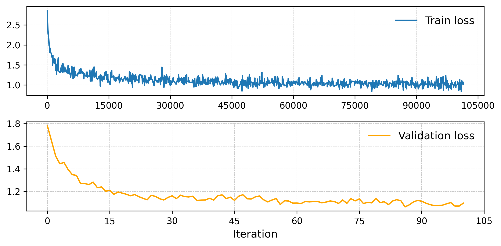

# GPT from scratch
Implementing from scratch the paper ["Improving Language Understanding by Generative Pre-Training"](https://cdn.openai.com/research-covers/language-unsupervised/language_understanding_paper.pdf) OpenAI GPT-1.

> Note: This implementation is inspired by the great [tutorial](https://www.youtube.com/watch?v=kCc8FmEb1nY) of Andrej Karpathy.
 
### Clone and install dependencies
``` 
git clone https://github.com/aldipiroli/gpt_from_scratch
pip install -r requirements.txt && cd gpt
``` 
### Train 
``` 
python train.py config/gpt_config.yaml
```
### Fine-tune 
``` 
python fine_tune.py --config config/gpt_finetune_config.yaml --ckpt path/to/ckpt
```
### Inference
``` 
python inference.py --config config/gpt_config.yaml --ckpt path/to/ckpt --prompt "the prompt"
``` 
### Examples 
1.6M model trained on 20% of [TinyStories](https://arxiv.org/abs/2305.07759) for ~100k iterations:

``` 
Prompt: "Once upon a time "
Output: "there was a little boy named Timmy. Timmy loved playing with RVs in the pieces of a storm. He bought come to ana we new toy!"

Prompt: "One day"
Output: ", Lily's dad her mom went to the park, stopped pictures outside in the woodow."

Prompt: "When"
Output: "a big tree. It was his favoury and white and realized near the flowers. They had a block hotel."
``` 
#### Train and validation losses
